# VSD RISC-V SoC Labs

## Introduction

This repository documents my step-by-step learning journey in the VSD RISC-V System-on-Chip (SoC) lab series. The goal is to gain hands-on experience with the RISC-V toolchain, cross-compiling C code for the RISC-V architecture, analyzing binaries, and running/debugging on emulators like QEMU and GDB.

Each week, I will add new tasks and their solutions.

This README will serve as a complete log of commands, code, outputs, screenshots, and explanations, making it a helpful reference for anyone new to RISC-V labs.

## Table of Contents

- [Introduction](#introduction)
- [Week 1](#week-1)
  - [Task 1: Install & Sanity-Check the Toolchain](#task-1-install--sanity-check-the-toolchain)
  - [Task 2: Compile "Hello, RISC-V"](#task-2-compile-hello-risc-v)
  - [Task 3: From C to Assembly](#task-3-from-c-to-assembly)
  - [Task 4: Hex Dump & Disassembly](#task-4-hex-dump--disassembly)
  - [Task 5: ABI & Register Cheat-Sheet](#task-5-abi--register-cheat-sheet)
  - [Task 6: Stepping with GDB](#task-6-stepping-with-gdb)
  - [Task 7: Running Under an Emulator](#task-7-running-under-an-emulator)
  - [Task 8: Exploring GCC Optimisation](#task-8-exploring-gcc-optimisation)
  - [Task 9: Inline Assembly Basics](#task-9-inline-assembly-basics)
  - [Task 10: Memory-Mapped I/O Demo](#task-10-memory-mapped-io-demo)
  - [Task 11: Linker Script 101](#task-11-linker-script-101)
  - [Task 12: Start-up Code & crt0](#task-12-start-up-code--crt0)
  - [Task 13: Interrupt Primer](#task-13-interrupt-primer)
  - [Task 14: rv32imac vs rv32imc - What's the "A"?](#task-14-rv32imac-vs-rv32imc---whats-the-a)
  - [Task 15: Atomic Test Program](#task-15-atomic-test-program)
  - [Task 16: Using Newlib printf Without an OS](#task-16-using-newlib-printf-without-an-os)
  - [Task 17: Endianness & Struct Packing](#task-17-endianness--struct-packing)

## Week 1

### Task 1: Install & Sanity-Check the Toolchain

**Objective:**  
Set up the RISC-V cross-compilation toolchain on Ubuntu, add it to your PATH, and verify that the main tools (`gcc`, `objdump`, `gdb`) are working.

---

#### **Process**

1. **Created a directory for the toolchain:**
    ```
    mkdir -p ~/riscv-toolchain
    ```
    This ensures the toolchain will be extracted into a dedicated folder in your home directory.

2. **Extracted the downloaded toolchain tarball:**
    ```
    tar -xvzf ~/Downloads/riscv-toolchain-rv32imac-x86_64-ubuntu.tar.gz -C ~/riscv-toolchain
    ```
    This unpacks the toolchain into `~/riscv-toolchain/opt/riscv`.

3. **Added the toolchain to the system PATH:**
    ```
    echo 'export PATH=$HOME/riscv-toolchain/opt/riscv/bin:$PATH' >> ~/.bashrc
    source ~/.bashrc
    ```
    This makes the RISC-V tools available in any terminal session.

4. **Verified the installation by checking versions:**
    ```
    riscv32-unknown-elf-gcc --version
    riscv32-unknown-elf-objdump --version
    riscv32-unknown-elf-gdb --version
    ```
    All tools reported their versions, confirming a successful setup.

---

#### **Output**

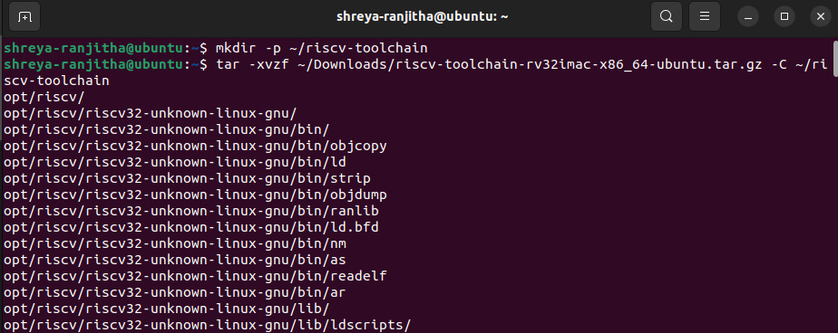
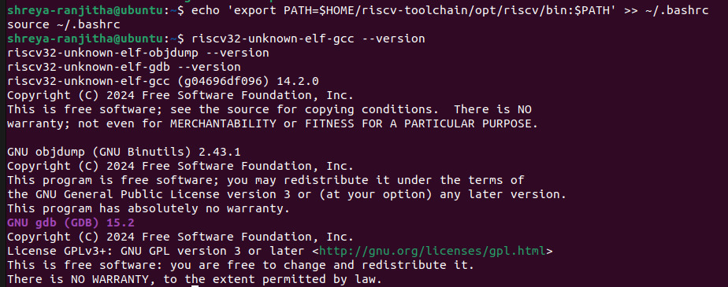

---

### Task 2: Compile "Hello, RISC-V"

**Objective:**  
Write a minimal C program that prints "Hello, RISC-V!" and cross-compile it for RISC-V, verifying the ELF output.

---

#### **Process**

1. **Created the C source file (`hello.c`):**
    ```
    #include <stdio.h>
    int main() {
        printf("Hello, RISC-V!\n");
        return 0;
    }
    ```
    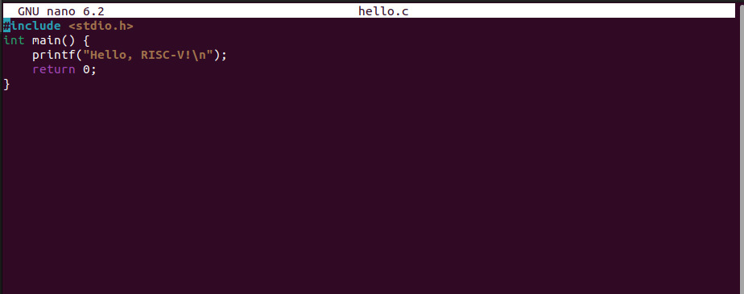
 

2. **Compiled the C file to a RISC-V ELF executable:**
    ```
    riscv32-unknown-elf-gcc -o hello.elf hello.c
    ```
   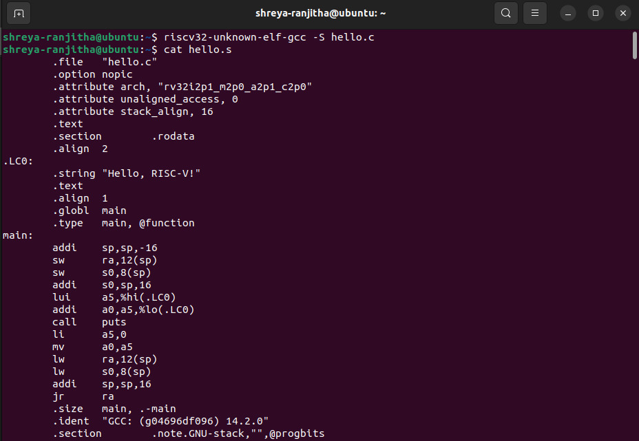
3. **Checked the generated ELF file:**
    ```
    file hello.elf
    ```
    Output confirms it is an ELF 32-bit RISC-V executable.

    

---

#### **Explanation**

- The `hello.c` file is a minimal C program using `printf` to print a message.
- The `riscv32-unknown-elf-gcc` command cross-compiles the C code for the RISC-V architecture, producing an ELF binary.
- The `file` command verifies the output is a valid RISC-V ELF executable.

---
### Task 3: From C to Assembly

**Objective:**  
Generate the assembly code for the minimal "Hello, RISC-V!" C program and explain the function prologue and epilogue.

---

#### **Process**

1. **Compiled the C file to assembly:**
    ```
    riscv32-unknown-elf-gcc -S hello.c
    cat hello.s
    ```
    

---

#### **Explanation**

- The `-S` flag tells the compiler to produce assembly code (`hello.s`) from the C source.
- The generated assembly includes:
  - **String Section:**  
    `.string "Hello, RISC-V!"` stores the string constant.
  - **Function Prologue:**  
    ```
    addi    sp,sp,-16
    sw      ra,12(sp)
    sw      s0,8(sp)
    addi    s0,sp,16
    ```
    These instructions allocate stack space and save the return address (`ra`) and frame pointer (`s0`).
  - **Function Body:**  
    Loads the address of the string into a register and calls `puts` to print the message.
  - **Function Epilogue:**  
    ```
    lw      ra,12(sp)
    lw      s0,8(sp)
    addi    sp,sp,16
    jr      ra
    ```
    Restores the stack and returns from the function.


---

### Task 4: Hex Dump & Disassembly

**Objective:**  
Disassemble the RISC-V ELF file and convert it to a raw Intel HEX format, understanding the meaning of each column in the outputs.

---

#### **Process**

1. **Disassembled the ELF file using objdump:**
    ```
    riscv32-unknown-elf-objdump -d hello.elf > hello.dump
    cat hello.dump
    ```
    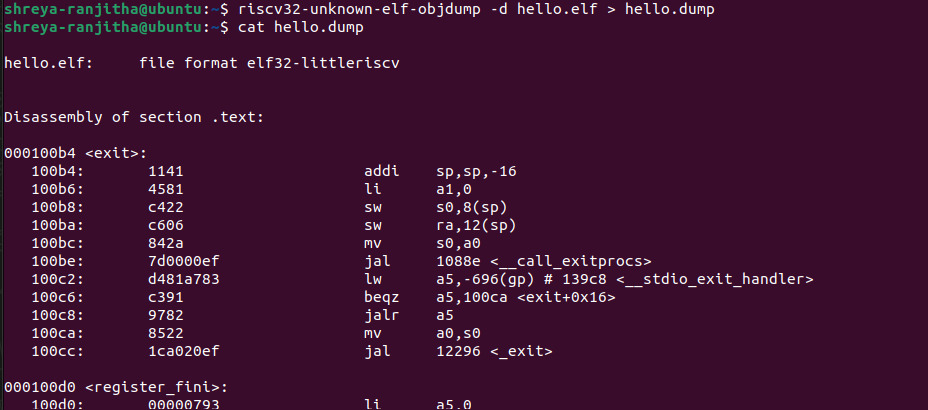

    - **Explanation:**  
      - The first column is the memory address of each instruction.
      - The second column is the raw machine code (opcode) in hexadecimal.
      - The third column is the assembly mnemonic and operands.
      - For example, `100b4: 1141 addi sp,sp,-16` means:  
        - At address `0x100b4`, the instruction `addi sp,sp,-16` is encoded as `1141`.

2. **Converted the ELF to Intel HEX format:**
    ```
    riscv32-unknown-elf-objcopy -O ihex hello.elf hello.hex
    cat hello.hex
    ```
    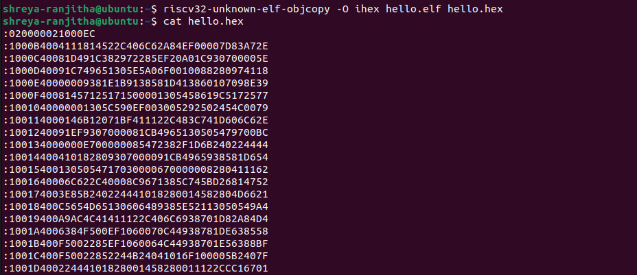

    - **Explanation:**  
      - Each line in the HEX file represents a chunk of binary data from the ELF, encoded in Intel HEX format.
      - The columns show the byte count, address, record type, data, and checksum.

---


### Task 5: ABI & Register Cheat-Sheet

**Objective:**  
List all 32 RV32 integer registers with their ABI names and typical calling-convention roles.

---

#### **RISC-V Integer Register Table**

| Register | ABI Name | Description                      | Preserved Across Calls? | Typical Role                         |
|----------|----------|----------------------------------|------------------------|--------------------------------------|
| x0       | zero     | Hard-wired zero                  | n/a                    | Constant zero                        |
| x1       | ra       | Return address                   | No                     | Stores return address for function calls |
| x2       | sp       | Stack pointer                    | Yes                    | Points to top of stack               |
| x3       | gp       | Global pointer                   | n/a                    | Points to global data                |
| x4       | tp       | Thread pointer                   | n/a                    | Points to thread data                |
| x5       | t0       | Temporary register 0             | No                     | Caller-saved temporary               |
| x6       | t1       | Temporary register 1             | No                     | Caller-saved temporary               |
| x7       | t2       | Temporary register 2             | No                     | Caller-saved temporary               |
| x8       | s0/fp    | Saved register 0 / frame pointer | Yes                    | Callee-saved, frame pointer          |
| x9       | s1       | Saved register 1                 | Yes                    | Callee-saved                         |
| x10      | a0       | Function argument 0 / return val | No                     | Argument / return value              |
| x11      | a1       | Function argument 1 / return val | No                     | Argument / return value              |
| x12      | a2       | Function argument 2              | No                     | Argument                             |
| x13      | a3       | Function argument 3              | No                     | Argument                             |
| x14      | a4       | Function argument 4              | No                     | Argument                             |
| x15      | a5       | Function argument 5              | No                     | Argument                             |
| x16      | a6       | Function argument 6              | No                     | Argument                             |
| x17      | a7       | Function argument 7              | No                     | Argument                             |
| x18      | s2       | Saved register 2                 | Yes                    | Callee-saved                         |
| x19      | s3       | Saved register 3                 | Yes                    | Callee-saved                         |
| x20      | s4       | Saved register 4                 | Yes                    | Callee-saved                         |
| x21      | s5       | Saved register 5                 | Yes                    | Callee-saved                         |
| x22      | s6       | Saved register 6                 | Yes                    | Callee-saved                         |
| x23      | s7       | Saved register 7                 | Yes                    | Callee-saved                         |
| x24      | s8       | Saved register 8                 | Yes                    | Callee-saved                         |
| x25      | s9       | Saved register 9                 | Yes                    | Callee-saved                         |
| x26      | s10      | Saved register 10                | Yes                    | Callee-saved                         |
| x27      | s11      | Saved register 11                | Yes                    | Callee-saved                         |
| x28      | t3       | Temporary register 3             | No                     | Caller-saved temporary               |
| x29      | t4       | Temporary register 4             | No                     | Caller-saved temporary               |
| x30      | t5       | Temporary register 5             | No                     | Caller-saved temporary               |
| x31      | t6       | Temporary register 6             | No                     | Caller-saved temporary               |

---

### Task 6: Stepping with GDB

**Objective:**  
Start GDB on the RISC-V ELF file, set a breakpoint at `main`, step through the code, and inspect registers and disassembly.

---

#### **Process**

1. **Started GDB and connected to QEMU:**
    ```
    riscv32-unknown-elf-gdb hello.elf
    (gdb) target remote localhost:1234
    ```
    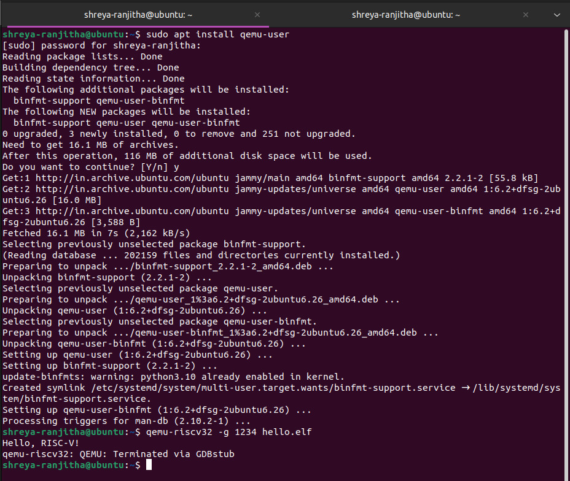

2. **Set a breakpoint at `main` and began stepping:**
    ```
    (gdb) break main
    (gdb) continue
    (gdb) next
    (gdb) stepi
    ```
    - The program stopped at the `main` function as expected.
    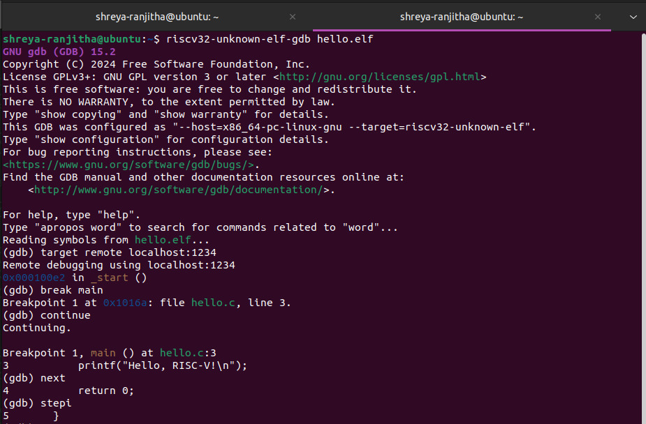

3. **Inspected registers and disassembled `main`:**
    ```
    (gdb) info registers
    (gdb) disassemble
    ```
    - Register values and the full disassembly of `main` were displayed.
    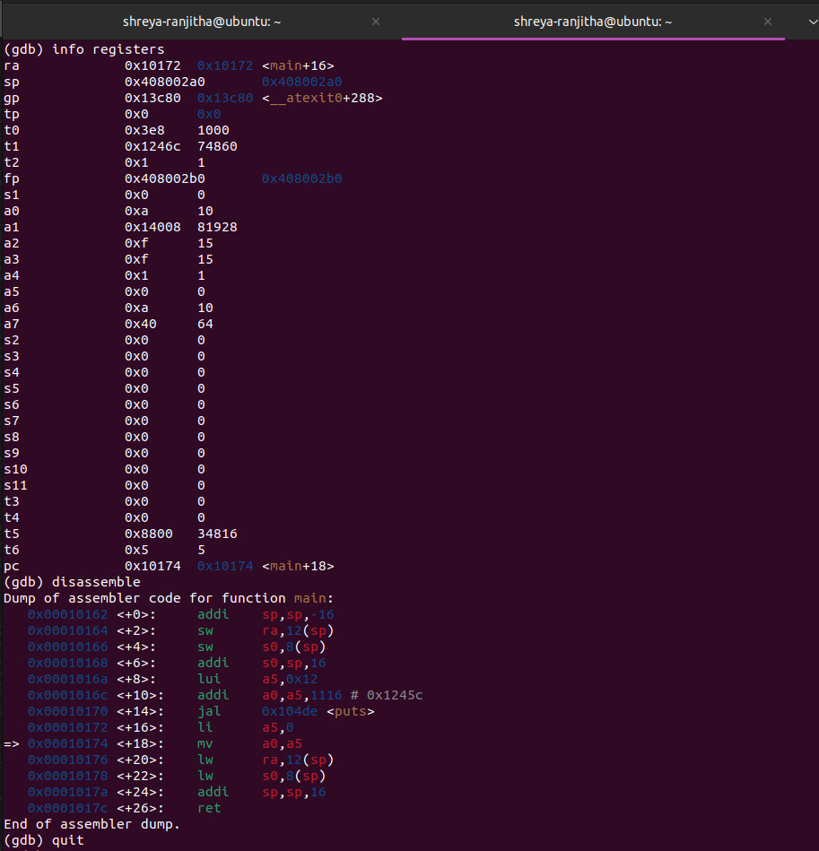

---

#### **Explanation**

- **GDB Setup:**  
  Started GDB with the ELF, connected to QEMU’s GDB server, and set a breakpoint at `main`.
- **Stepping:**  
  Used `next` to step through C source lines and `stepi` for single assembly instructions.
- **Register Inspection:**  
  `info registers` showed the current values of all CPU registers, including program counter (`pc`), stack pointer (`sp`), and return address (`ra`).
- **Disassembly:**  
  `disassemble` displayed the assembly code for the `main` function, showing the prologue, body, and epilogue.

---

### Task 7: Running Under an Emulator

**Objective:**  
Run a bare-metal RISC-V ELF on QEMU and print to the UART console.

---

#### **Process**

1. **Wrote minimal startup code (`crt0.s`):**
    ```
    .section .init
    .globl _start
    _start:
        la sp, _stack_top
        la a0, _sbss
        la a1, _ebss
        li a2, 0
    bss_loop:
        bge a0, a1, call_main
        sw a2, 0(a0)
        addi a0, a0, 4
        j bss_loop
    call_main:
        call main
    hang:
        j hang
    ```
    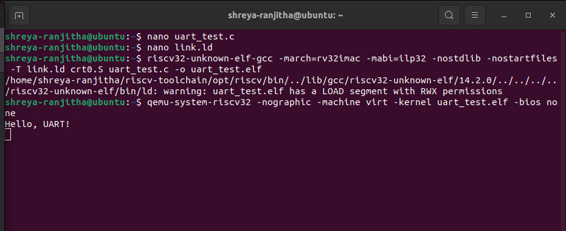

2. **Created a linker script (`link.ld`):**
    ```
    SECTIONS {
      .text 0x80000000 : { *(.text*) }
      .data 0x10000000 : { *(.data*) *(.sdata*) }
      .bss : { *(.bss*) *(.sbss*) }
      _sbss = ADDR(.bss);
      _ebss = ADDR(.bss) + SIZEOF(.bss);
      _stack_top = 0x10020000;
    }
    ```
    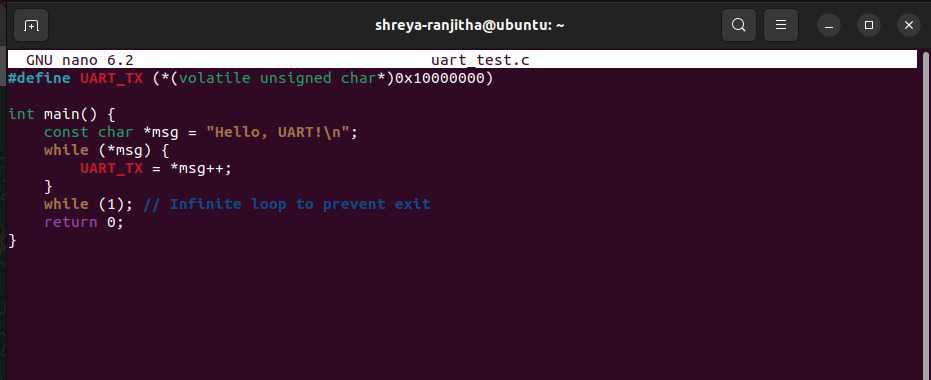

3. **Wrote a UART test program (`uart_test.c`):**
    ```
    #define UART_TX (*(volatile unsigned char*)0x10000000)

    int main() {
        const char *msg = "Hello, UART!\n";
        while (*msg) {
            UART_TX = *msg++;
        }
        while (1); // Infinite loop to prevent exit
        return 0;
    }
    ```
    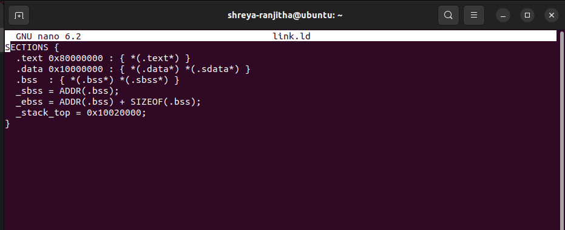

4. **Compiled and ran the program in QEMU:**
    ```
    riscv32-unknown-elf-gcc -march=rv32imac -mabi=ilp32 -nostdlib -nostartfiles -T link.ld crt0.s uart_test.c -o uart_test.elf
    qemu-system-riscv32 -nographic -machine virt -kernel uart_test.elf -bios none
    ```
    - The QEMU terminal displayed:  
      `Hello, UART!`
    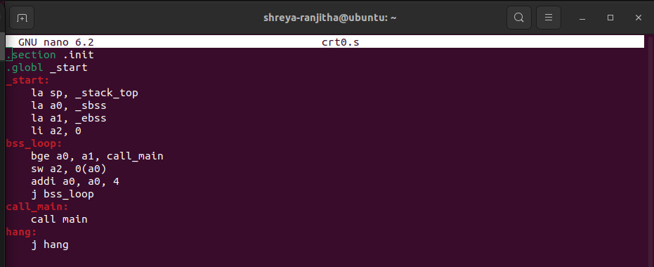

---

### Task 8: Exploring GCC Optimisation

**Objective:**  
Compile the same C program with different optimization levels (-O0 vs -O2) and analyze the differences in the generated assembly code.

---

#### **Process**

1. **Compiled with no optimization (-O0):**
    ```
    riscv32-unknown-elf-gcc -march=rv32imc -mabi=ilp32 -O0 -S hello.c -o hello_O0.s
    ```

2. **Compiled with level 2 optimization (-O2):**
    ```
    riscv32-unknown-elf-gcc -march=rv32imc -mabi=ilp32 -O2 -S hello.c -o hello_O2.s
    ```

3. **Compared the assembly outputs:**
    ```
    diff -u hello_O0.s hello_O2.s
    ```
    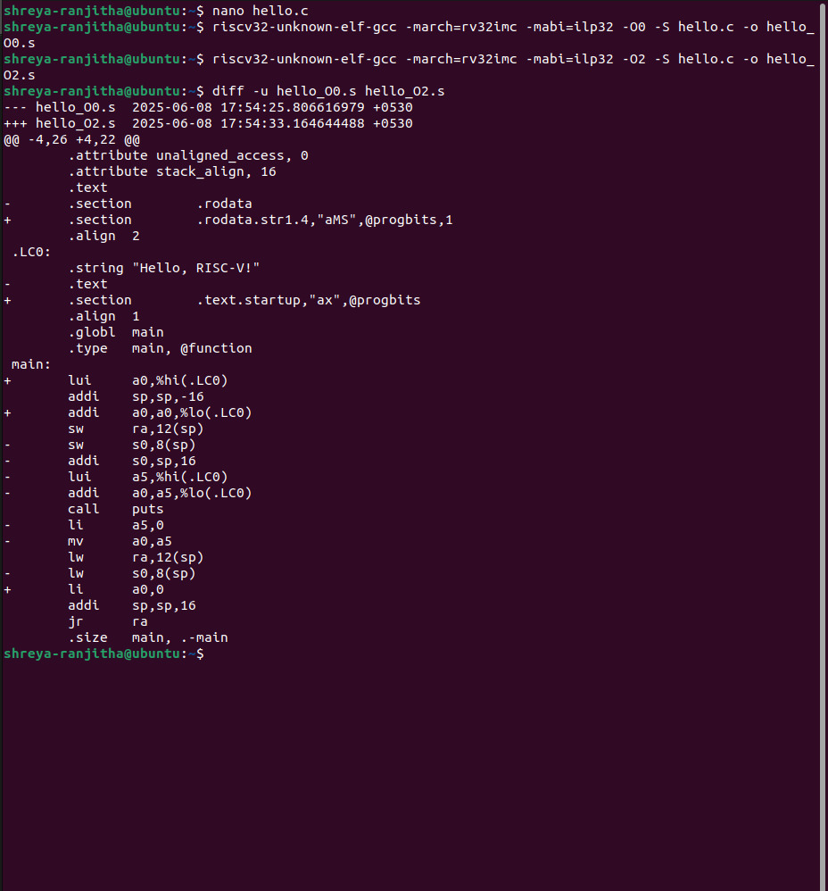

---

#### **Explanation**

The comparison reveals several key optimization differences:

- **Code Size Reduction:**  
  The `-O2` optimized version shows significant changes in the assembly structure, with many instructions being eliminated or reorganized.

- **Function Call Optimization:**  
  The optimized version may inline simple function calls or replace `printf` calls with more efficient alternatives like `puts` when appropriate.

- **Register Allocation:**  
  Better register usage is evident in the `-O2` version, reducing unnecessary memory operations and improving execution efficiency.

- **Instruction Scheduling:**  
  The compiler reorders instructions to minimize pipeline stalls and improve instruction-level parallelism.

- **Dead Code Elimination:**  
  Unused variables and redundant operations are removed in the optimized version.

- **Stack Frame Optimization:**  
  The optimized version may use fewer stack operations and more efficient prologue/epilogue sequences.

---

### Task 9: Inline Assembly Basics

**Objective:**  
Write a C function that returns the cycle counter by reading CSR 0xC00 using inline assembly and explain each constraint.

---

#### **Process**

1. **Implemented the cycle counter function with inline assembly:**
    ```
    #include <stdint.h>
    #include <stdio.h>

    static inline uint32_t rdcycle(void) {
        uint32_t c;
        asm volatile ("csrr %0, cycle" : "=r"(c));
        return c;
    }

    int main() {
        uint32_t cycles = rdcycle();
        printf("Cycle counter: %u\n", cycles);
        return 0;
    }
    ```
    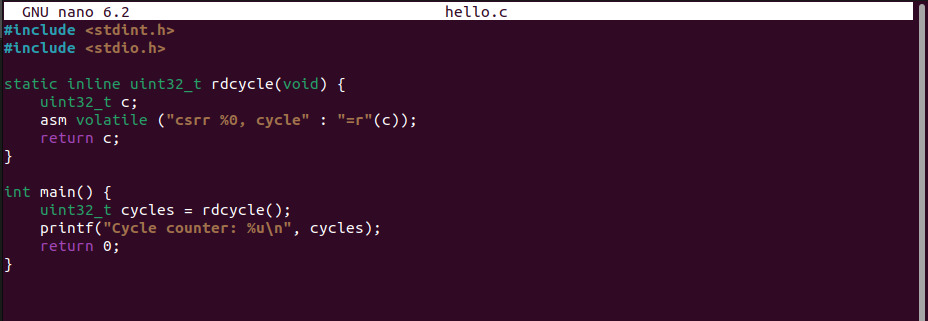

2. **Compiled and executed the program:**
    ```
    riscv32-unknown-elf-gcc -march=rv32gc -mabi=ilp32 -o hello.elf hello.c
    qemu-riscv32 hello.elf
    ```
    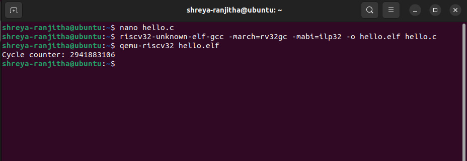

---

#### **Explanation**

**Inline Assembly Breakdown:**
- **`asm volatile`:** Tells the compiler this is inline assembly that should not be optimized away
- **`"csrr %0, cycle"`:** The RISC-V assembly instruction to read the cycle CSR (0xC00)
  - `csrr` = Control and Status Register Read
  - `%0` = Placeholder for the first output operand
  - `cycle` = The cycle counter CSR
- **`: "=r"(c)`:** Output constraint specifying:
  - `=` = Output operand (write-only)  
  - `r` = Use any general-purpose register
  - `(c)` = Store result in variable `c`

**Why `volatile`:**
- Prevents compiler from optimizing away the assembly
- Ensures the instruction executes every time the function is called
- Important for reading hardware registers that may change between accesses

**CSR 0xC00 (cycle):**
- Hardware counter that increments with each clock cycle
- Provides a way to measure execution time and performance
- Read-only from user mode in RISC-V

---

### Task 10: Memory-Mapped I/O Demo

**Objective:**  
Demonstrate bare-metal C code to toggle a GPIO register located at 0x10012000, and explain how to prevent the compiler from optimizing away the store.

---

#### **Process**

1. **Wrote the GPIO toggle program (`gpio_toggle.c`):**
    ```
    #include <stdint.h>

    void toggle_gpio() {
        volatile uint32_t *gpio = (uint32_t *)0x10012000;
        *gpio = 0x1; // Set GPIO high
        *gpio = 0x0; // Set GPIO low
    }

    int main() {
        toggle_gpio();
        while (1); // Prevent exit (for bare-metal)
        return 0;
    }
    ```
    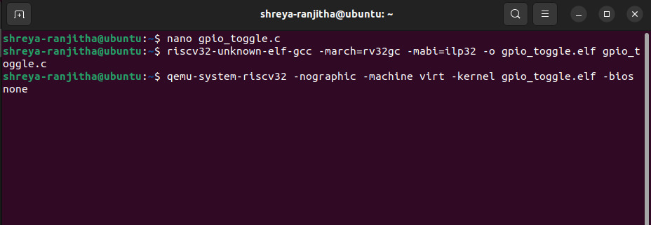

2. **Compiled and ran the program in QEMU:**
    ```
    riscv32-unknown-elf-gcc -march=rv32gc -mabi=ilp32 -o gpio_toggle.elf gpio_toggle.c
    qemu-system-riscv32 -nographic -machine virt -kernel gpio_toggle.elf -bios none
    ```
    

---

#### **Explanation**

- **Memory-Mapped I/O:**  
  The GPIO register is accessed by casting its address (`0x10012000`) to a pointer and dereferencing it.
- **The `volatile` Keyword:**  
  Declaring the pointer as `volatile` tells the compiler not to optimize away the store operations, ensuring both writes (`*gpio = 0x1;` and `*gpio = 0x0;`) actually occur.
- **Bare-Metal Infinite Loop:**  
  The `while (1);` loop in `main` prevents the program from exiting, which is standard practice in bare-metal embedded code.

---

### Task 10: Memory-Mapped I/O Demo

**Objective:**  
Demonstrate bare-metal C code to toggle a GPIO register located at 0x10012000, and explain how to prevent the compiler from optimizing away the store.

---

#### **Process**

1. **Wrote the GPIO toggle program (`gpio_toggle.c`):**
    ```
    #include <stdint.h>

    void toggle_gpio() {
        volatile uint32_t *gpio = (uint32_t *)0x10012000;
        *gpio = 0x1; // Set GPIO high
        *gpio = 0x0; // Set GPIO low
    }

    int main() {
        toggle_gpio();
        while (1); // Prevent exit (for bare-metal)
        return 0;
    }
    ```
    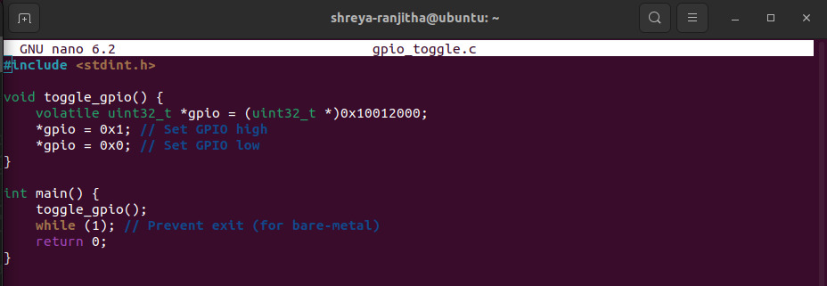

2. **Compiled and ran the program in QEMU:**
    ```
    riscv32-unknown-elf-gcc -march=rv32gc -mabi=ilp32 -o gpio_toggle.elf gpio_toggle.c
    qemu-system-riscv32 -nographic -machine virt -kernel gpio_toggle.elf -bios none
    ```
    

---

#### **Explanation**

- **Memory-Mapped I/O:**  
  The GPIO register is accessed by casting its address (`0x10012000`) to a pointer and dereferencing it.
- **The `volatile` Keyword:**  
  Declaring the pointer as `volatile` tells the compiler not to optimize away the store operations, ensuring both writes (`*gpio = 0x1;` and `*gpio = 0x0;`) actually occur.
- **Bare-Metal Infinite Loop:**  
  The `while (1);` loop in `main` prevents the program from exiting, which is standard practice in bare-metal embedded code.

---
### Task 11: Linker Script 101

**Objective:**  
Understand and modify a linker script to control the placement of `.text` and `.data` sections in memory, and observe the effect on ELF section addresses.

---

#### **Process**

1. **Created a custom linker script (`link.ld`):**
    ```
    SECTIONS {
      .text 0x00000000 : { *(.text*) }
      .data 0x10000000 : { *(.data*) }
    }
    ```
    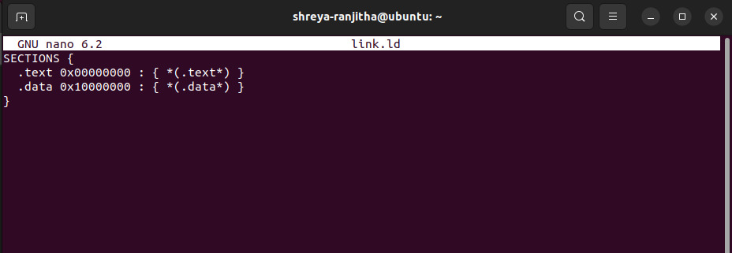

2. **Wrote a test C program (`hello.c`) with initialized data:**
    ```
    int mydata = 42;

    int main() {
        while (1);
        return 0;
    }
    ```
    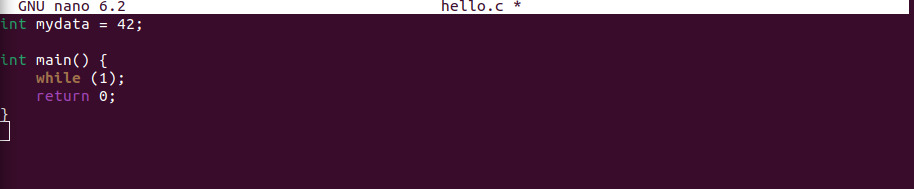

3. **Modified to use an array in the data section:**
    ```
    int mydata = {1, 2, 3};

    int main() {
        while (1);
        return 0;
    }
    ```
    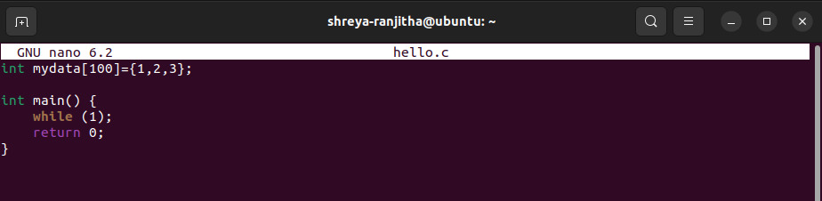

4. **Compiled and examined ELF section headers:**
    ```
    riscv32-unknown-elf-gcc -march=rv32imc -mabi=ilp32 -nostdlib -nostartfiles -T link.ld -o hello.elf hello.c
    riscv32-unknown-elf-objdump -h hello.elf
    ```
    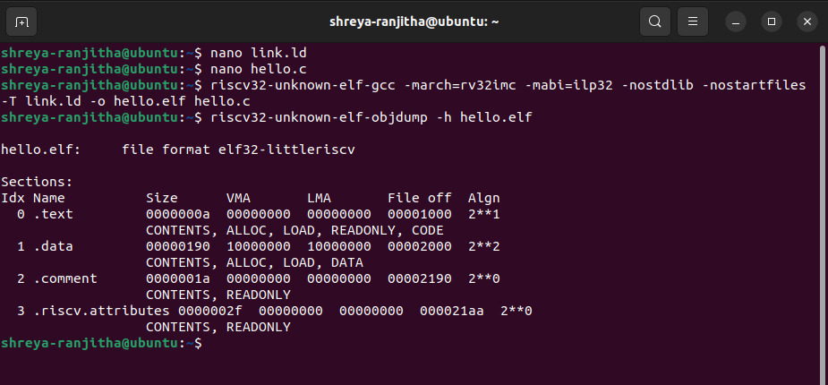

---

#### **Explanation**

- The linker script explicitly places the `.text` (code) section at address `0x00000000` and the `.data` (initialized data) section at address `0x10000000`.
- By changing the size of the `mydata` array in `hello.c`, the size of the `.data` section in the ELF file increases, which is reflected in the section headers.
- The `objdump -h` output shows the virtual memory addresses (VMA) and sizes of each section, confirming the effect of the linker script on the final memory layout.

---

### Task 12: Start-up Code & crt0

**Objective:**  
Understand and implement a minimal RISC-V startup routine (`crt0.s`) and linker script (`link.ld`) to correctly initialize the stack and .bss section before calling `main`.

---

#### **Process**

1. **Wrote the startup assembly file (`crt0.s`):**
    ```
    .section .init
    .globl _start
    _start:
        la sp, _stack_top            # Set up stack pointer (symbol from linker script)

        # (Optional) Clear .bss section
        la a0, _sbss
        la a1, _ebss
        li a2, 0
    bss_loop:
        bge a0, a1, call_main
        sw a2, 0(a0)
        addi a0, a0, 4
        j bss_loop

    call_main:
        call main

    hang:
        j hang
    ```
    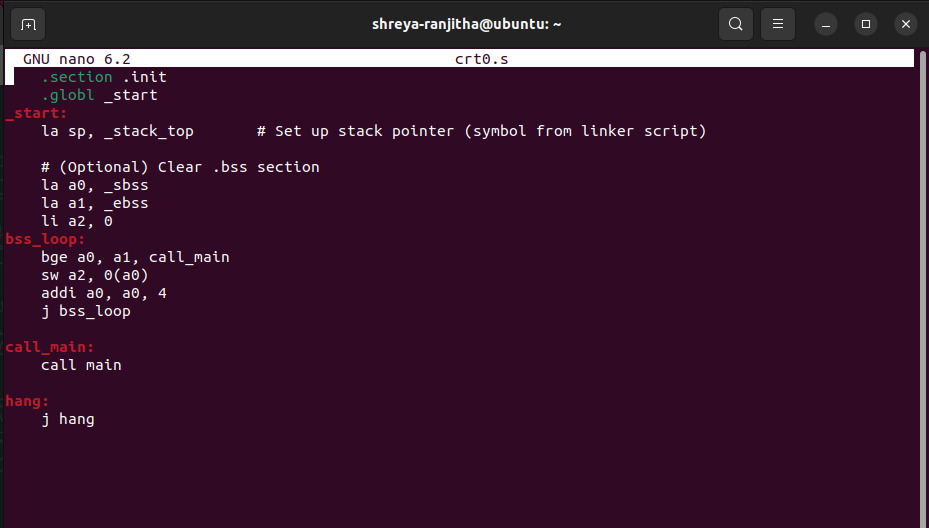

2. **Created the linker script (`link.ld`):**
    ```
    SECTIONS {
      .text 0x00000000 : { *(.text*) }
      .data 0x10000000 : { *(.data*) *(.sdata*) }
      .bss : { *(.bss*) *(.sbss*) }
      _sbss = ADDR(.bss);
      _ebss = ADDR(.bss) + SIZEOF(.bss);
      _stack_top = 0x10020000; /* Example stack top address */
    }
    ```
    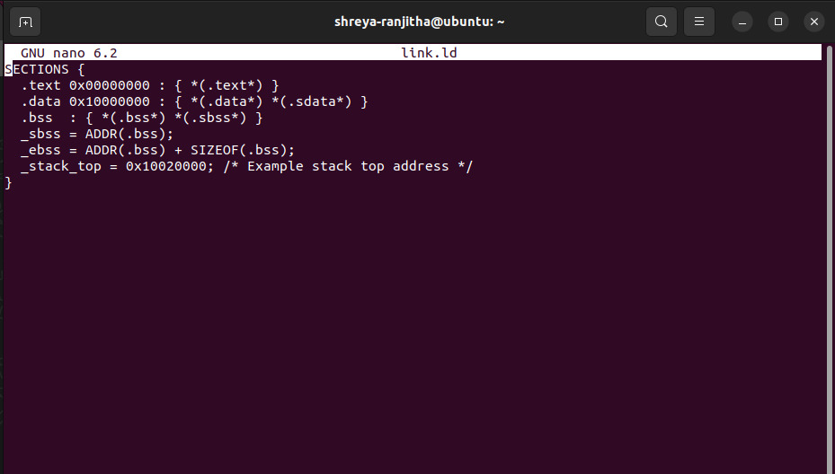

3. **Compiled and disassembled the ELF:**
    ```
    riscv32-unknown-elf-gcc -march=rv32imc -mabi=ilp32 -nostdlib -nostartfiles -T link.ld crt0.s hello.c -o hello.elf
    riscv32-unknown-elf-objdump -d hello.elf
    ```
    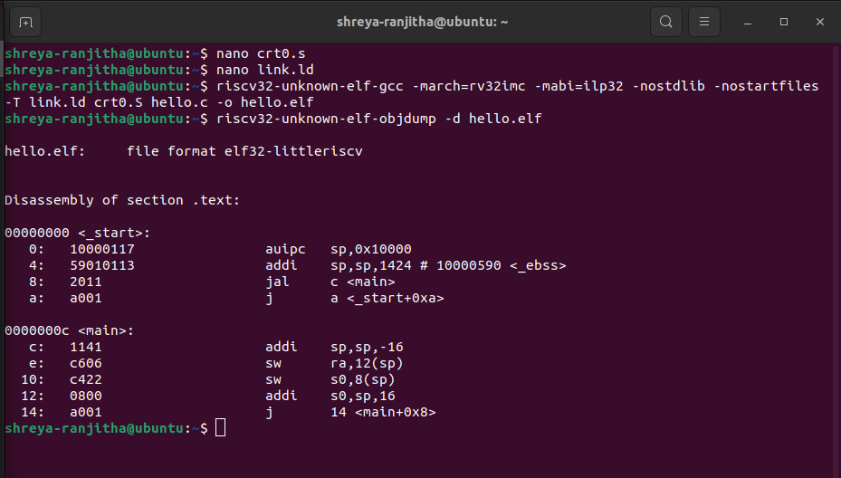

---

#### **Explanation**

- The `crt0.s` file sets up the stack pointer, clears the `.bss` section (zero-initialized data), and then calls `main`. If `main` returns, the code enters an infinite loop (`hang`).
- The linker script (`link.ld`) defines where each section (`.text`, `.data`, `.bss`) is placed in memory and provides symbols for the stack and `.bss` boundaries.
- The disassembly output confirms that the startup code and `main` are correctly linked and located at the specified addresses.

---
### Task 13: Interrupt Primer

**Objective:**  
Implement a basic timer interrupt handler in RISC-V, configure the interrupt controller, and observe variable changes in GDB when the interrupt fires.

---

#### **Process**

1. **Wrote the timer interrupt handler in C (`timer_interrupt.c`):**
    ```
    #include <stdint.h>

    // Memory-mapped addresses for QEMU virt machine
    #define MTIME    (*(volatile uint64_t *)0x0200bff8)
    #define MTIMECMP (*(volatile uint64_t *)0x02004000)

    // Global variable to show change from interrupt
    volatile unsigned int myreg = 0;

    // Timer interrupt handler
    void __attribute__((interrupt)) timer_handler(void) {
        MTIMECMP = MTIME + 1000000; // Schedule next interrupt
        myreg++;                    // Change variable on each interrupt
    }

    // Set mtvec to handler address
    static inline void set_mtvec(void (*handler)()) {
        asm volatile("csrw mtvec, %0" :: "r"(handler));
    }

    // Enable timer and global interrupts
    static inline void enable_timer_interrupts() {
        asm volatile("csrs mie, %0" :: "r"(1 << 7));   // Enable MTIE
        asm volatile("csrs mstatus, %0" :: "r"(1 << 3)); // Enable MIE
    }

    void timer_init(uint64_t delta) {
        MTIMECMP = MTIME + delta;
    }

    int main() {
        set_mtvec(timer_handler);
        timer_init(1000000); // First timer after 1 million cycles
        enable_timer_interrupts();
        while (1) {
            // Observe 'myreg' in GDB to see it increment on each interrupt
        }
    }
    ```
    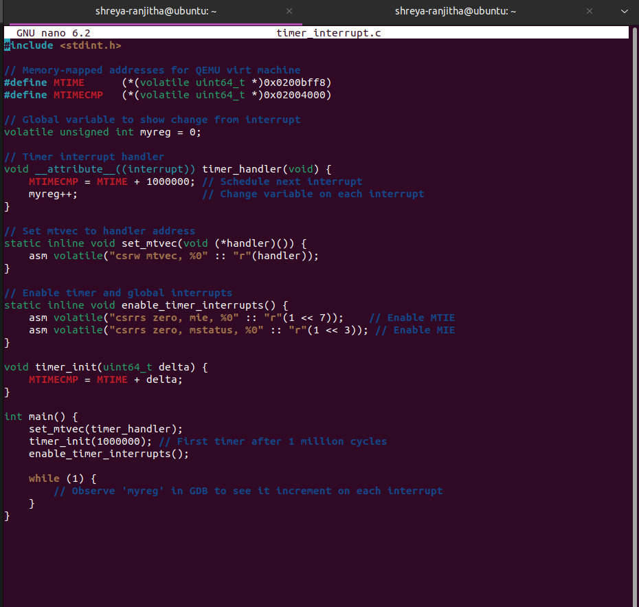

2. **Launched QEMU with GDB server enabled:**
    ```
    qemu-system-riscv32 -nographic -machine virt -kernel timer_interrupt.elf -bios none -s -S
    ```
    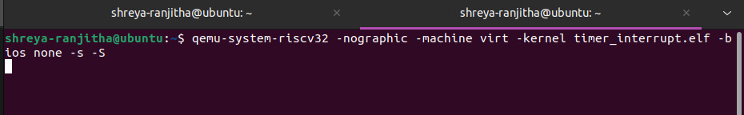

3. **Connected with GDB, set breakpoints and watchpoints:**
    ```
    riscv32-unknown-elf-gdb timer_interrupt.elf
    (gdb) target remote :1234
    (gdb) break main
    (gdb) continue
    (gdb) watch myreg
    (gdb) continue
    ```
    - Each time the timer interrupt fires, `myreg` increments, and GDB displays the change.
    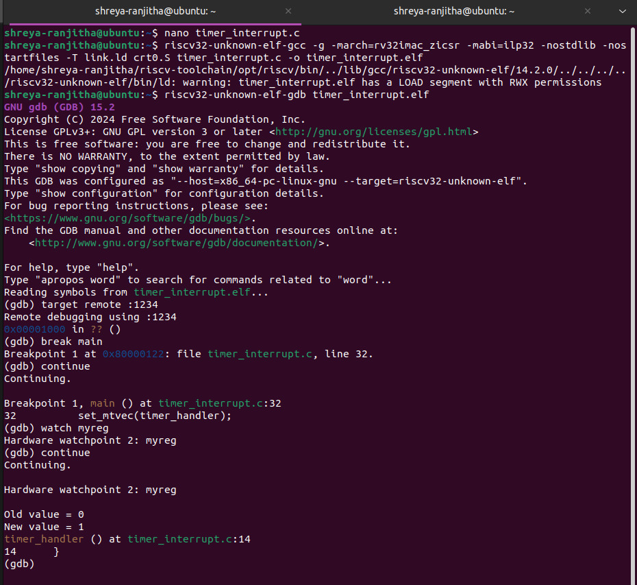

---

#### **Explanation**

- The timer interrupt handler (`timer_handler`) is registered by writing its address to the `mtvec` CSR.
- The handler schedules the next timer interrupt and increments a global variable, `myreg`.
- Timer and global interrupts are enabled by setting the appropriate bits in the `mie` and `mstatus` CSRs.
- QEMU is run with the `-s -S` flags to enable the GDB server and halt at startup.
- In GDB, a watchpoint is set on `myreg` to observe its value change each time the interrupt fires, confirming correct interrupt handling.

---
### Task 14: rv32imac vs rv32imc – What’s the “A”?

**Objective:**  
Understand the difference between the RISC-V `rv32imac` and `rv32imc` architectures, focusing on the "A" extension for atomic instructions, and demonstrate the use of atomic operations in C with inline assembly.

---

#### **Process**

1. **Wrote an atomic add function in C using inline assembly:**
    ```
    int atomic_add(volatile int *ptr, int val) {
        int old, tmp;
        __asm__ volatile (
            "1: lr.w %0, (%2)\n"
            "add %1, %0, %3\n"
            "sc.w %1, %1, (%2)\n"
            "bnez %1, 1b\n"
            : "=&r"(old), "=&r"(tmp)
            : "r"(ptr), "r"(val)
            : "memory"
        );
        return old;
    }
    ```
    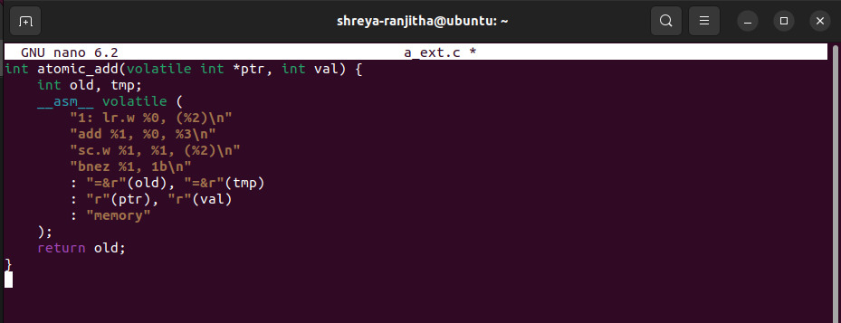

2. **Compiled the code for both `rv32imac` and `rv32imc`:**
    ```
    riscv32-unknown-elf-gcc -march=rv32imac -mabi=ilp32 -S a_ext.c -o a_ext_imac.s
    riscv32-unknown-elf-gcc -march=rv32imc -mabi=ilp32 -S a_ext.c -o a_ext_imc.s
    ```

3. **Inspected the generated assembly for both variants:**
    - With `rv32imac`, atomic instructions (`lr.w` and `sc.w`) are present.
    - With `rv32imc`, these instructions are not supported, and compilation may fail or omit atomic operations.
    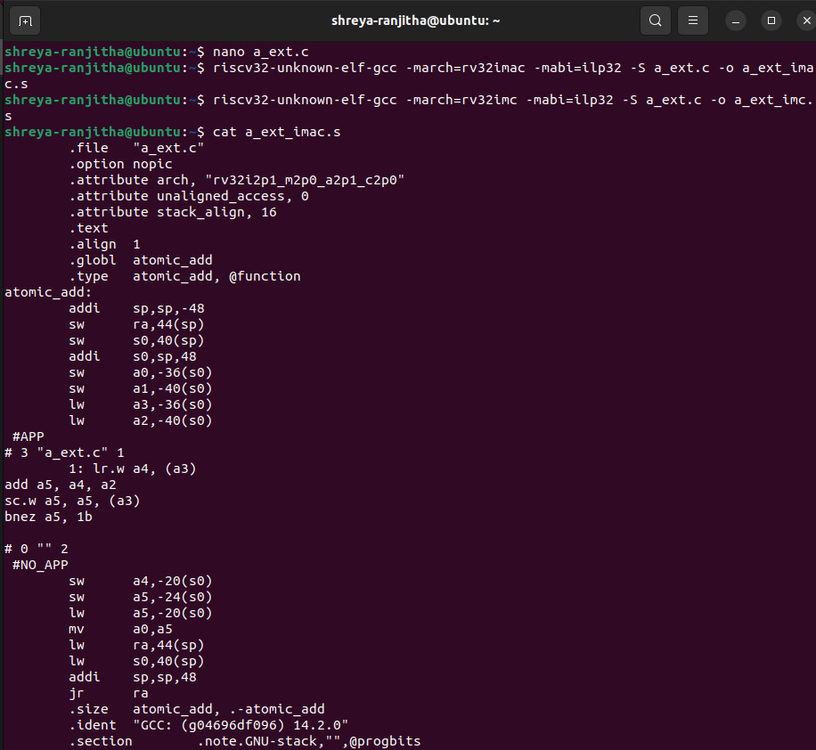
    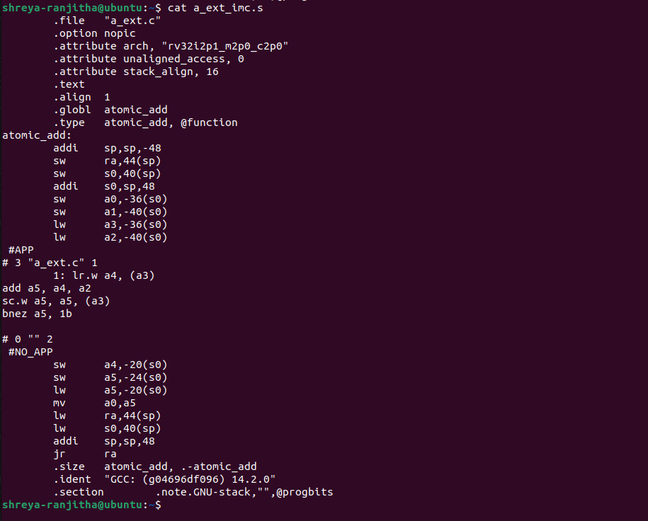

---

#### **Explanation**

- **What is the "A" Extension?**  
  The "A" in `rv32imac` stands for the **Atomic** extension, which adds instructions for atomic read-modify-write operations such as `lr.w` (load-reserved) and `sc.w` (store-conditional)[7][5][6][8].
  - These are essential for implementing thread-safe operations, mutexes, semaphores, and lock-free data structures in multicore or multithreaded environments[5][7].
- **Difference Between rv32imac and rv32imc:**  
  - `rv32imac` supports atomic instructions and can compile and run code using them.
  - `rv32imc` does **not** support atomic instructions; attempts to use them will fail or not generate the atomic code.
- **Why Use Atomics?**  
  - Atomics are required for safe concurrent programming, ensuring operations like incrementing a shared variable are performed without race conditions.
- **How Does the Code Work?**  
  - The `atomic_add` function uses `lr.w` and `sc.w` in a loop to perform an atomic addition:  
    - `lr.w` loads the value (with a reservation).
    - `add` computes the result.
    - `sc.w` attempts to store the result only if no other core has modified the value; if it fails, the loop retries.

---

