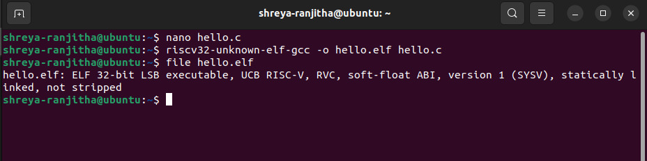

# VSD RISC-V SoC Labs

## Introduction

This repository documents my step-by-step learning journey in the VSD RISC-V System-on-Chip (SoC) lab series. The goal is to gain hands-on experience with the RISC-V toolchain, cross-compiling C code for the RISC-V architecture, analyzing binaries, and running/debugging on emulators like QEMU and GDB.

Each week, I will add new tasks and their solutions.

This README will serve as a complete log of commands, code, outputs, screenshots, and explanations, making it a helpful reference for anyone new to RISC-V labs.

## Table of Contents

- [Introduction](#introduction)
- [Week 1](#week-1)
  - [Task 1: Install & Sanity-Check the Toolchain](#task-1-install--sanity-check-the-toolchain)
  - [Task 2: Compile "Hello, RISC-V"](#task-2-compile-hello-risc-v)
  - [Task 3: From C to Assembly](#task-3-from-c-to-assembly)
  - [Task 4: Hex Dump & Disassembly](#task-4-hex-dump--disassembly)
  - [Task 5: ABI & Register Cheat-Sheet](#task-5-abi--register-cheat-sheet)
  - [Task 6: Stepping with GDB](#task-6-stepping-with-gdb)
  - [Task 7: Running Under an Emulator](#task-7-running-under-an-emulator)
  - [Task 8: Exploring GCC Optimisation](#task-8-exploring-gcc-optimisation)
  - [Task 9: Inline Assembly Basics](#task-9-inline-assembly-basics)
  - [Task 10: Memory-Mapped I/O Demo](#task-10-memory-mapped-io-demo)
  - [Task 11: Linker Script 101](#task-11-linker-script-101)
  - [Task 12: Start-up Code & crt0](#task-12-start-up-code--crt0)
  - [Task 13: Interrupt Primer](#task-13-interrupt-primer)
  - [Task 14: rv32imac vs rv32imc - What's the "A"?](#task-14-rv32imac-vs-rv32imc---whats-the-a)
  - [Task 15: Atomic Test Program](#task-15-atomic-test-program)
  - [Task 16: Using Newlib printf Without an OS](#task-16-using-newlib-printf-without-an-os)
  - [Task 17: Endianness & Struct Packing](#task-17-endianness--struct-packing)

## Week 1

### Task 1: Install & Sanity-Check the Toolchain

**Objective:**  
Set up the RISC-V cross-compilation toolchain on Ubuntu, add it to your PATH, and verify that the main tools (`gcc`, `objdump`, `gdb`) are working.

---

#### **Process**

1. **Created a directory for the toolchain:**
    ```
    mkdir -p ~/riscv-toolchain
    ```
    This ensures the toolchain will be extracted into a dedicated folder in your home directory.

2. **Extracted the downloaded toolchain tarball:**
    ```
    tar -xvzf ~/Downloads/riscv-toolchain-rv32imac-x86_64-ubuntu.tar.gz -C ~/riscv-toolchain
    ```
    This unpacks the toolchain into `~/riscv-toolchain/opt/riscv`.

3. **Added the toolchain to the system PATH:**
    ```
    echo 'export PATH=$HOME/riscv-toolchain/opt/riscv/bin:$PATH' >> ~/.bashrc
    source ~/.bashrc
    ```
    This makes the RISC-V tools available in any terminal session.

4. **Verified the installation by checking versions:**
    ```
    riscv32-unknown-elf-gcc --version
    riscv32-unknown-elf-objdump --version
    riscv32-unknown-elf-gdb --version
    ```
    All tools reported their versions, confirming a successful setup.

---

#### **Output**


## Week 2

### Task 1: Compile "Hello, RISC-V" and Generate Assembly

**Objective:**  
Write a minimal C program that prints "Hello, RISC-V!", cross-compile it for RV32IMC, and generate the corresponding assembly code.

---

#### **Process**

1. **Created the C source file (`hello.c`):**
    ```
    #include <stdio.h>
    int main() {
        printf("Hello, RISC-V!\n");
        return 0;
    }
    ```
    

2. **Generated assembly from C source:**
    ```
    riscv32-unknown-elf-gcc -S hello.c
    cat hello.s
    ```
    

---

#### **Explanation**

- The `-S` flag tells the compiler to generate assembly (`hello.s`) instead of an object or executable.
- The assembly file shows the function prologue, the loading of the string, and the call to `puts` (which is used by `printf` for simple strings).
- Key instructions in the prologue:
  - `addi sp,sp,-16` : Allocates stack space.
  - `sw ra,12(sp)` : Saves the return address.
  - `sw s0,8(sp)` : Saves the frame pointer.
  - `lui`/`addi` : Loads the string address.
  - `call puts` : Calls the function to print the string.
- The epilogue restores the stack and returns.

---


